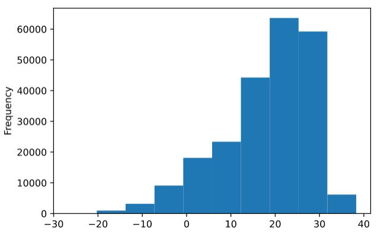

## Numpy

### Links
- [https://www.freecodecamp.org/news/exploratory-data-analysis-with-numpy-pandas-matplotlib-seaborn/](https://www.freecodecamp.org/news/exploratory-data-analysis-with-numpy-pandas-matplotlib-seaborn/)
- [https://saturncloud.io/blog/speed-comparison-numpy-vs-python-standard-library/](https://saturncloud.io/blog/speed-comparison-numpy-vs-python-standard-library/)

## Pandas

### Grundlagen

Ähnlich wie **Numpy**, kann aber noch viel mehr.

Kann strukturierte Daten (Excel, CSV, ...) einlesen

```python
import pandas as pd

df = pd.read_csv("teilnehmer.csv")
# df ist ein sogenanntes DataFrame

# df
# df.head()
```

Ausgabe direkt mit df oder df.head()

Hilfe von pd.read_csv
```python
pd.read_csv?
```
Falls die CSV-daten durch einen Semikolon (;) getrennt sind
```python
df = pd.read_csv("teilnehmer.csv", sep=";")
df.head
```

### Auf Spalten zugreifen

```python
import pandas as pd

df = pd.read_csv("../data/Temperature/GlobalLandTemperaturesByMajorCity.csv.bz2")
df.head()

#dt 	AverageTemperature 	AverageTemperatureUncertainty   City 	Country Latitude 	Longitude
#0 	1849-01-01 	26.704 	1.435 	Abidjan 	Côte D'Ivoire   5.63N 	3.23W
#1 	1849-02-01 	27.434 	1.362 	Abidjan 	Côte D'Ivoire 	5.63N 	3.23W
#2 	1849-03-01 	28.101 	1.612 	Abidjan 	Côte D'Ivoire 	5.63N 	3.23W
#3 	1849-04-01 	26.140 	1.387 	Abidjan 	Côte D'Ivoire 	5.63N 	3.23W
#4 	1849-05-01 	25.427 	1.200 	Abidjan 	Côte D'Ivoire 	5.63N 	3.23W
```

Die Anzahl der Datensätze:
```python
print(len(df))
# 239177
```

Auf eine einzelne Spalte zugreifen:
```python
df["City"]
#print(df["City"])

#0         Abidjan
#1         Abidjan
#2         Abidjan
#3         Abidjan
#4         Abidjan
           ...   
#239172       Xian
#239173       Xian
#239174       Xian
#239175       Xian
#239176       Xian
#Name: City, Length: 239177, dtype: object
```

Es ergibt sich eine **Pandas-Series** -> ähnlich einem numpy-Array

Auf einzelne Zeilen zugreifen:
```python
print(df["City"][1000])
# Abidjan

print(df["City"][1000:1010])
```

Zugriff auf mehrere Spalten:
```python
print(df[["Country", "City"]])
#print(df[["Country", "City"]]).head()
```

**Wichtig:** hierbei entsteht immer ein **neues Dataframe**

Um eine Spalte zu entfernen
```python
#df.drop(["AverageTemperatureUncertainty"]) --> Fehler, da er nach Zeilen sucht die AverageTemperatureUncertainty enthalten
df = df.drop(["AverageTemperatureUncertainty"], axis = 1)
# besser
df.drop(["AverageTemperatureUncertainty"], axis = 1, inplace = True)
```

### Spalten auswerten

auf eine Series zugreifen mit z.B:
```python
df["AverageTemperature"]
```
auf diese Series kann man jetzt verschiedene Berechnungen durchführen, z.B. mean, min, max, ...
```python
print(df["AverageTemperature"].min())
print(df["AverageTemperature"].max())
print(df["AverageTemperature"].max())
print(df["AverageTemperature"].sum())
# -26.772
# 38.283
# 18.1259688528542
# 4135892.9429999995
```

eine Series in ein numpy-Array umwandeln
```python
print(df["AverageTemperature"].to_numpy())
print(df["AverageTemperature"].to_numpy().shape)
```

Man kann eine Series sehr gut plotten:
```python
%matplotlib inline
%config InlineBackend.figure_format = 'svg'

df["AverageTemperature"].plot.hist()
```


### Auf Zeilen zugreifen

Beim Einlesen werden alle Zeilen durchnummeriert. Auf diese Nummerierung kann man mit der .loc-Schreibweise zugreifen
```python
df.loc[0]

#dt                                  1849-01-01
#AverageTemperature                      26.704
#AverageTemperatureUncertainty            1.435
#City                                   Abidjan
#Country                          Côte D'Ivoire
#Latitude                                 5.63N
#Longitude                                3.23W
#Name: 0, dtype: object
```

Auf einzelne Werte
```python
df.loc[0].["AverageTemperature"]
```

In ein Python-Dictionary umwandeln
```python
dict(df.loc[0])
```

Funktioniert auch auf einzelne Spalten
```python
df["City"].loc[239172]
```

Daten **filtern**
```python
df[df["Country"] == "Germany"]
```

Wie funktioniert dies:
```python
df["Country"] == "Germany"
# liefert eine Series vom type bool mit True- und False-Werten
```

**Der ursprüngliche Index(labels) bleibt erhalten!!!**
```python
df_germany = df[df["Country"] == "Germany"]
df_germany.head()
# 	dt 	AverageTemperature 	AverageTemperatureUncertainty 	City 	Country 	Latitude 	Longitude
#24500 	1743-11-01 	6.326 	1.601 	Berlin 	Germany 	52.24N 	13.14E
#24501 	1743-12-01 	NaN 	NaN 	Berlin 	Germany 	52.24N 	13.14E
#24502 	1744-01-01 	NaN 	NaN 	Berlin 	Germany 	52.24N 	13.14E
#24503 	1744-02-01 	NaN 	NaN 	Berlin 	Germany 	52.24N 	13.14E
#24504 	1744-03-01 	NaN 	NaN 	Berlin 	Germany 	52.24N 	13.14E
```

Um über einen neuen Index zu arbeiten die iloc-Schreibweise verwenden
```python
df_germany.iloc[0]

#dt                               1743-11-01
#AverageTemperature                    6.326
#AverageTemperatureUncertainty         1.601
#City                                 Berlin
#Country                             Germany
#Latitude                             52.24N
#Longitude                            13.14E
#Name: 24500, dtype: object
```

Um mehrere Bedingungen zu kombinieren - Klammern nicht vergessen
```python
df[(df["Country"] == "Germany") | (df["Country"] == "France")]

df[(df["Country"] == "Germany") & (df["City"] == "Berlin")]
```

### Daten abändern

zum Ändern von Daten gibt es verschiedene Möglichkeiten
```python
# alle Spaltenwerte ändern
df["Country"] = "World"
```

Um eine neue, noch nicht existierende Spalte anzulegen:
```python
df["Planet"] = "World"
```

pandas-Series verhalten sich ähnlich wie numpy-Arrays. Man kann z.B überall 5 hinzufügen
```python
print(df["AverageTemperature"] + 5)

df["AverageTemperatureNew"] = df["AverageTemperature"] + 5
#df["AverageTemperature"] = df["AverageTemperature"] + 5
# statt der Series kann auch ein Numpy-Array stehen (gleiche Anzahl wichtig)
```

Nur bestimmte Werte überschreiben
```python
df[df["Country"] == "Germany"]["Country"] = "Deutschland"
```

Im oberen Beispiel wird das ursprüngliche DataFrame nicht überschrieben. Dies geht nur über die
.loc-Schreibweise
```python
Spalte City und Country für die Zeile mit dem Label 0
df.loc[0, ["City", "Country"]]
```

```python
df.loc[df["Country"] == "Germany", "Country"] = "Deutschland"
```

Beispiel: Durchschnittstemperatur nie größer als 25 ist
```python
df.loc[df["AverageTemperature"] >= 25, "AverageTemperature"] = 25

df
```

### Pandas Aufgabe

[eine_Zeile.csv](data/eine_Zeile.csv)

Der Inhalt der Datei data/eine_Zeile.csv ist:

A|B|C|D#1|2|3|4#5|6|7|8#9|10|11|12#13|14|15|16#

Lies den Inhalt so als Dataframe ein, dass es sich um 5 Zeilen mit 4 Spalten handelt.

Die Ausgabe des Dataframe soll so aussehen:
```python
   A  B  C  D
0  1  2  3  4
1  5  6  7  8
2  9 10 11 12
3 13 14 15 16
```

### Pandas Aufgaben


## Merkblätter

[Merkblatt_Pandas](pdfs/Merkblatt_Pandas.pdf)

[Merkblatt_CSV](pdfs/Merkblatt_CSV.pdf)
